# Bug/Task Tracker Application
Demo URL: https://bug-tracky.netlify.app

## Overview

This is a bug/task tracker application built with React, Redux, and Tailwind CSS. The application allows users to create, edit, delete, and manage tasks with various attributes, including title, description, priority, status, assignee, due date, and more.

## Technologies Used

- **Frontend**: React.js, Next.js
- **State Management**: Redux
- **Styling**: Tailwind CSS
- **State Management Library**: Redux Toolkit

## Features

> User Authentication

> Create, edit, and delete tasks

> Filter and sort tasks by priority and status

> Time tracking for each task

> Responsive design using Tailwind CSS

1. **User Authentication:**
   - Implemented a simple login system. used a mock authentication method.
     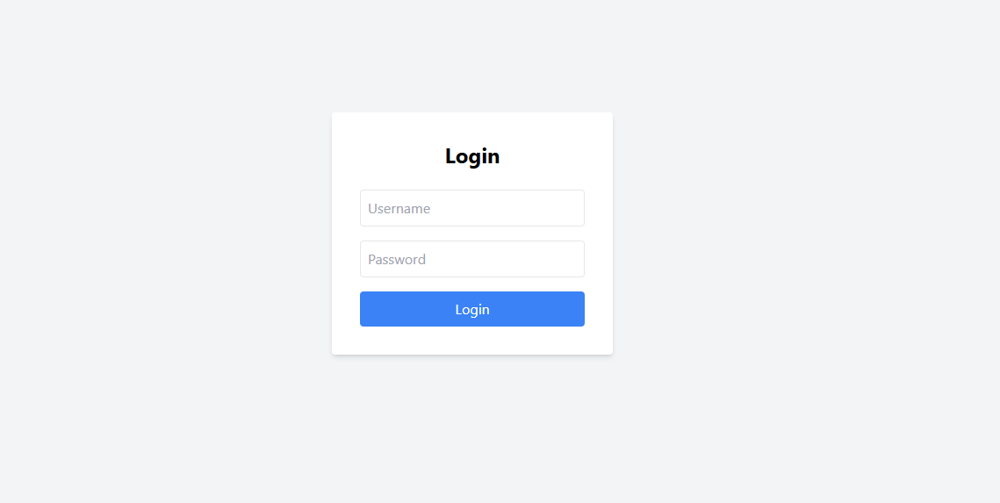
   - On successful login, the user redirected to the dashboard page.
     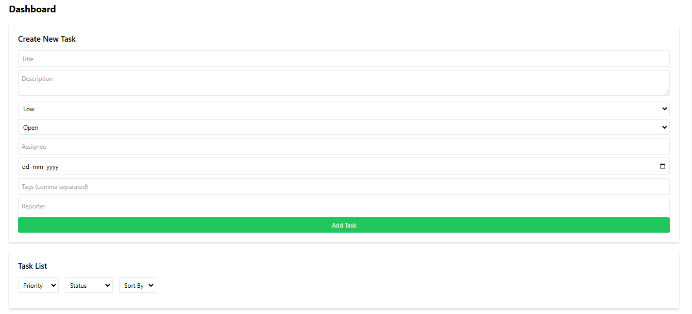
2. **Dashboard:**
   - After logging in, the user land on a dashboard where they can view and manage their tasks/bugs.
   - The dashboard displays a list of tasks with relevant details.
     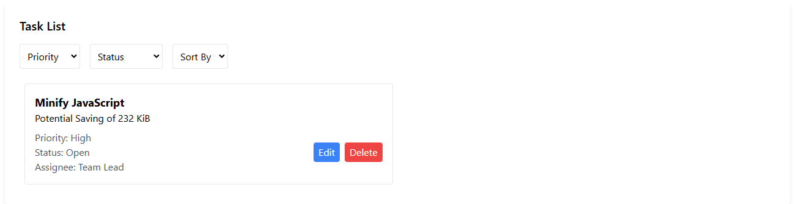
   - Dashboard should also have a trend line of concurrent tasks worked upon each day.
     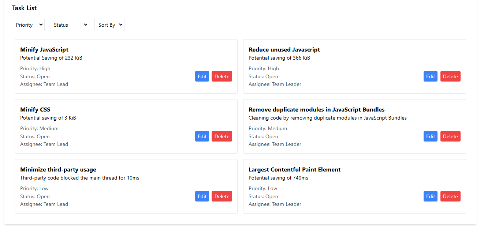
3. **Task/Bug Creation:** 
    - Users should be able to create a new task/bug for their team/projects with fields like Title, Description, Priority,Status Assignee, important dates, etc.
   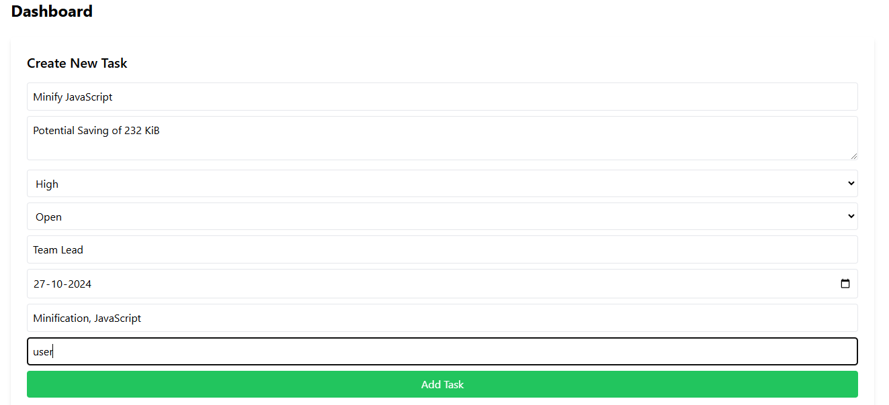
   
4. **Task/Bug Management:**
   - Users should be able to edit and delete tasks.
   - Implement a way to filter/sort tasks based on different criteria (priority, status, etc.).
   
5. **Time Tracker:**
   - Add a time tracking feature to log the time spent on each task.
   - Display the total time spent on each task.
6. **UI/UX:**
   - Focused on creating a clean, intuitive, and user-friendly interface.
   - Ensured the application is responsive and works well on desktop, brownie points for mobile compatibility.
7. **Technology Stack:**
   - Used `React.js` for the frontend framework.
   - Used `Tailwind-CSS` for styling.
   - Used `Redux` library for state management.

## Getting Started

### Prerequisites

- Node.js (version 14 or higher)
- npm (Node package manager)

### Installation

1. **Clone the repository**:

   ```bash
   git clone https://github.com/javid4962/Bug-Tracker.git
   cd Bug-Tracker
   ```
2. **Install Dependencies**:

   ```bash
   npm install
   ```

### Running the Application

1. **Start the Development Server**

    ```bash
    npm start
    ```
2. **Login Credentials**

    ```bash
    Username:user
    Password:password123
    ```

### Overview

> Login page:
> 

> Giving Credentials to login:
> 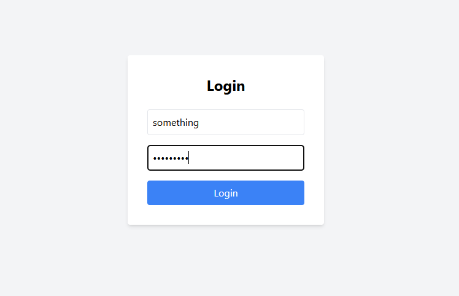

> Invalid Credentials:
> 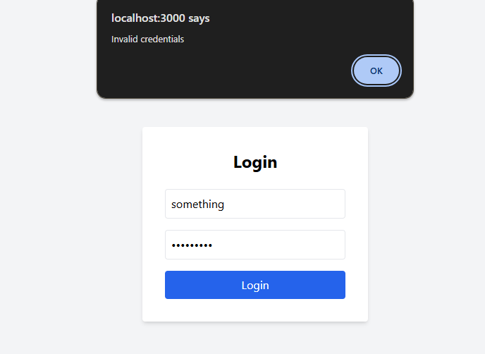

> Valid Credentials:
> 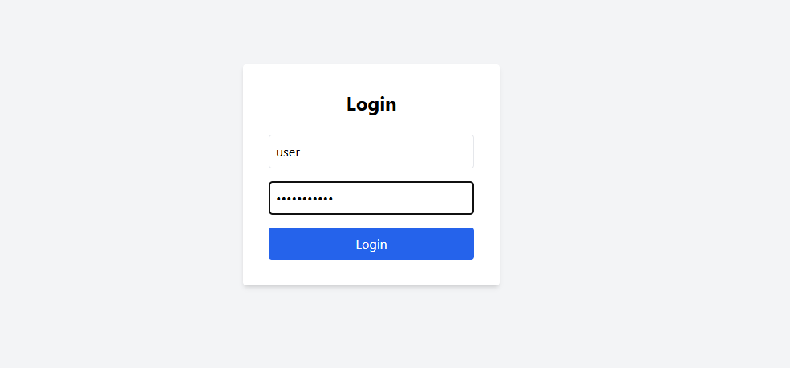

> Rendered to Dashboard page:
> 

> Creating a Task:
> 

> Adding Task:
> 

> Task Managing:
> 

> Updating/Editing Task:
> 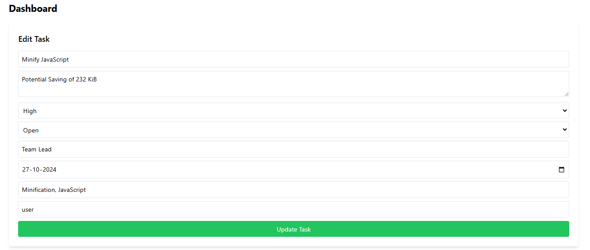

> Filtering Tasks:
> 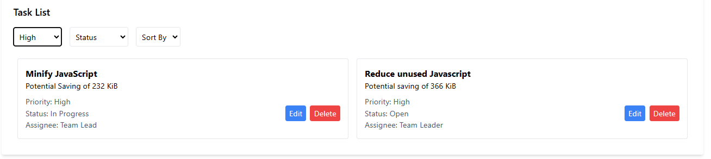
> 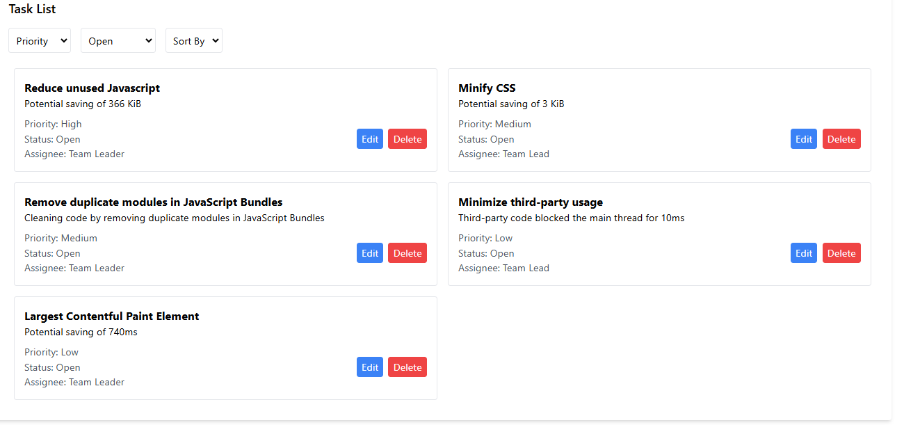

> Deleting Tasks:
> 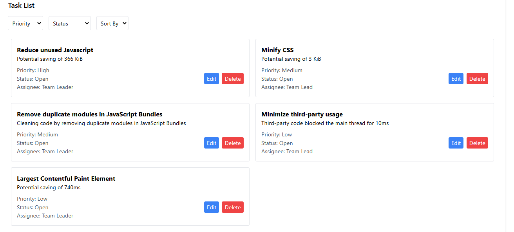
> 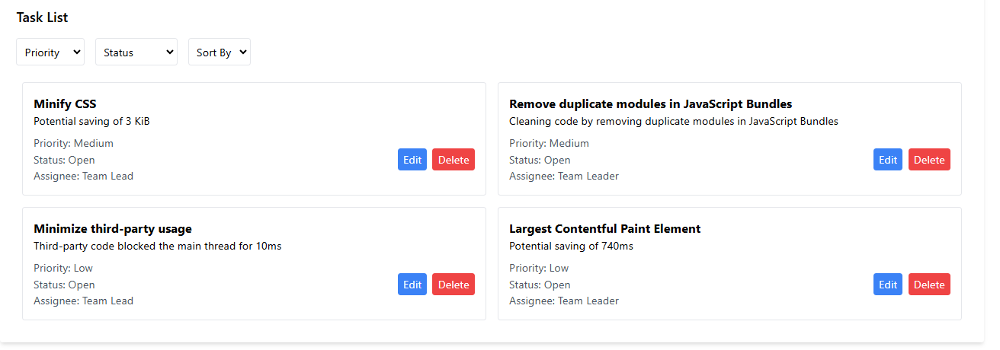
